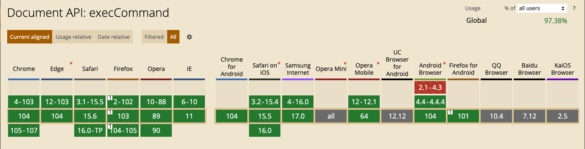
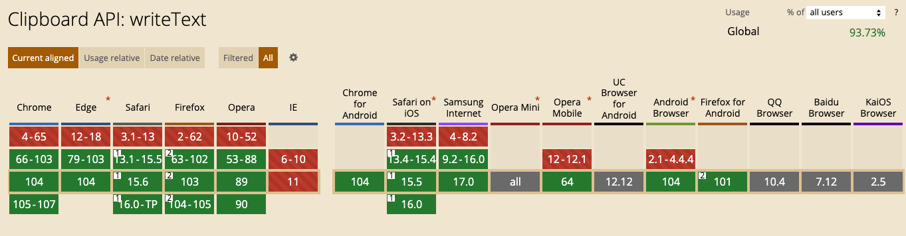

## 1.Copy

### 描述

当用户通过浏览器 `UI`（例如，使用 `Ctrl/⌘ + C` 键盘快捷方式或从菜单中选择“复制”）启动复制操作并响应允许的 `document.execCommand('copy')` 调用时触发`copy`事件。

### 简单栗子

```js
document.addEventListener('copy', function (e) {
  e.clipboardData.setData('text/plain', 'Hello, world!');
  e.preventDefault(); // We want our data, not data from any selection, to be written to the clipboard
});
```

在控制台执行上面代码，然后在执行

```js
document.execCommand('copy');
```

此时你的剪切板里就有 `Hello, world!`

### 问题 1 如何使用 `JavaScript` 复制我想要的文本信息。

背景：测试请教如何使用 `JavaScript` 复制我想要的文本信息。

#### 方法 1: `execCommand` 方法

首先，必须文字内容选中，再执行 execCommand()，通常是在 `<input>` 或者 `<textarea>` 元素中

核心代码如下

```js
// 内容选中
textarea.select();
// 执行复制
document.execCommand('copy', true);
```

实例 1: 输入框 `<input>` 或者 `<textarea>`

```tsx
import React from 'react';
import Test1 from './test1';
export default () => <Test1 />;
```

实例 2: 大部分情况不是输入框

通常做法是创建一个隐藏的输入框，赋值，选中，然后复制

```tsx
import React from 'react';
import Test2 from './test2';
export default () => <Test2 />;
```

限制/隐患

1、输入框可能不在页面的可视区域之内，此时执行 textarea.select() 方法会触发浏览器默认的控件跳转行为，也就是页面会触发滚动行为进行重定位。

2、复制的内容非常大，`execCommand()` 方法可能会引起卡顿，因为 `execCommand()` 方法是一个同步方法，必须等复制操作结束，才能继续执行后面的代码。

3、使用 `execCommand()` 方法复制的文字内容，是无法进行修改与替换的，这其实是不友好的，因为对复制或拖拽的本文内容进行处理还是比较常见的。

兼容性

  

#### 方法 2: `Clipboard API`

### 描述

使用 `Clipboard API` 实现复制效果就简单了。

### 简单栗子

核心代码如下

```js
if (navigator.clipboard) {
  navigator.clipboard.writeText(text);
}
```

其中，text 就是需要复制的文本内容，就这么简单。

无需浏览器权限申请，文字内容直接进入剪切板，代码简单，使用方便，同时是异步，不用担心阻塞。

实例 3: `Clipboard API`

直接调用 `Clipboard API` 即可

```tsx
import React from 'react';
import Test3 from './test3';
export default () => <Test3 />;
```

兼容性



#### 方法 3: 方法 1 + 方法 2

核心代码

```js
var text = '被复制的内容，啦啦啦~';
if (navigator.clipboard) {
  // clipboard api 复制
  navigator.clipboard.writeText(text);
} else {
  var textarea = document.createElement('textarea');
  document.body.appendChild(textarea);
  // 隐藏此输入框
  textarea.style.position = 'fixed';
  textarea.style.clip = 'rect(0 0 0 0)';
  textarea.style.top = '10px';
  // 赋值
  textarea.value = text;
  // 选中
  textarea.select();
  // 复制
  document.execCommand('copy', true);
  // 移除输入框
  document.body.removeChild(textarea);
}
```

#### 方法 4 知名开源 `clipboard.js` 项目 🌟 Star 32.4K

不仅有复制的实现，还有剪切等。

代码地址：[clipboard](https://github.com/zenorocha/clipboard.js/)

看代码实现 也是【创建一个隐藏的输入框，赋值，选中，然后复制】

<Badge type="error">不同之处: </Badge>

Move element to the same position vertically

将元素垂直移动到相同位置

#### 方法 5 知名开源 `copy-to-clipboard` 项目 🌟 Star 1K

代码地址：[copy-to-clipboard](https://github.com/sudodoki/copy-to-clipboard)

看代码实现 也是【创建一个隐藏的 span，赋值，选中，然后复制】

<Badge type="error">不同之处: </Badge> `range`

### 参考资料

1、[Copy](https://developer.mozilla.org/zh-CN/docs/Web/API/Element/copy_event)

2、[Range](https://developer.mozilla.org/zh-CN/docs/Web/API/Range)
