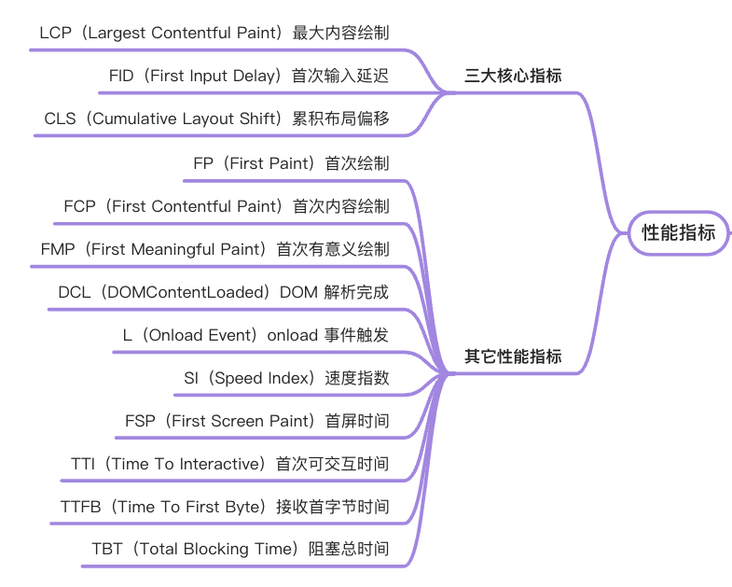
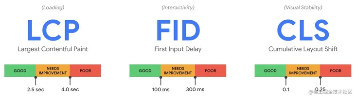
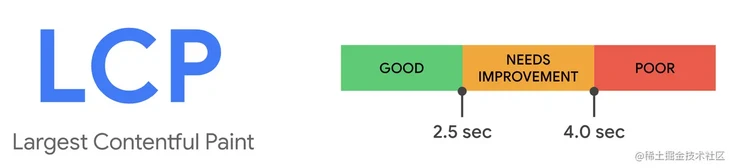
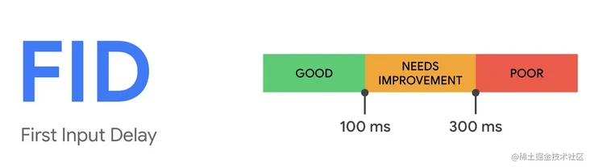
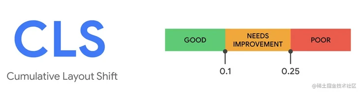
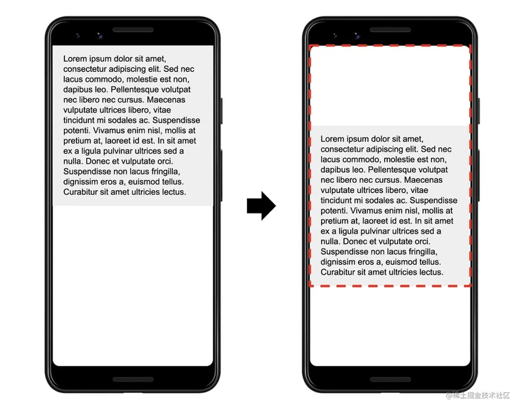

## 性能优化指标

性能指标的分类方式各样，如从用户体验的角度可分为`文档加载相关`的（`TTFB`、`DCL`、`L`），`内容呈现相关`的（`FP`、`FCP`、`FMP`），`交互响应相关`的（`FID`、`FSP`）。

在这就粗略分为两大类处理了，三大核心指标与其它常见的性能指标。



当前网站核心 Web 指标指标构成侧重于用户体验的三个方面——_加载性能_、交互性和视觉稳定性——并包括以下指标（及各指标相应的阈值）。

### 三大核心指标（Core Web Vitals）



#### LCP (Largest Contentful Paint)

`LCP` 代表了页面的速度指标，虽然还存在其他的一些体现速度的指标，但是上文也说过 `LCP` 能体现的东西更多一些。一是指标实时更新，数据更精确，二是代表着页面最大元素的渲染时间，通常来说页面中最大元素的快速载入能让用户感觉性能还挺好。



<b>最大元素</b>

那么哪些元素可以被定义为`最大元素`呢？

- `` 标签
- `<image>` 在 svg 中的 image 标签
- `<video>` video 标签
- CSS background url()加载的图片
- 包含内联或文本的块级元素

<b>原生的 JS API 测量</b>

LCP 还可以用 JS API 进行测量，主要使用 PerformanceObserver 接口，目前除了 IE 不支持，其他浏览器基本都支持了。

```js
new PerformanceObserver((entryList) => {
  for (const entry of entryList.getEntries()) {
    console.log('LCP candidate:', entry.startTime, entry);
  }
}).observe({ type: 'largest-contentful-paint', buffered: true });
```

<b>如何优化 LCP</b>

LCP 可能被这四个因素影响：

- 服务端响应时间
- Javascript 和 CSS 引起的渲染卡顿
- 资源加载时间
- 客户端渲染

#### FID (First Input Delay)

`FID` 代表了页面的交互体验指标，毕竟没有一个用户希望触发交互以后页面的反馈很迟缓，交互响应的快会让用户觉得网页挺流畅。

这个指标其实挺好理解，就是看用户交互事件触发到页面响应中间耗时多少，如果其中有长任务发生的话那么势必会造成响应时间变长。推荐响应用户交互在 `100ms` 以内.



<b>原生的 JS API 测量</b>

```js
new PerformanceObserver((entryList) => {
  for (const entry of entryList.getEntries()) {
    const delay = entry.processingStart - entry.startTime;
    console.log('FID candidate:', delay, entry);
  }
}).observe({ type: 'first-input', buffered: true });
```

<b>如何优化 FID</b>

FID 可能被这四个因素影响：

- 减少第三方代码的影响
- 减少 Javascript 的执行时间
- 最小化主线程工作
- 减小请求数量和请求文件大小

#### CLS (Cumulative Layout Shift)

`CLS` 代表了页面的稳定指标，它能衡量页面是否排版稳定。尤其在手机上这个指标更为重要，因为手机屏幕挺小，`CLS`值一大的话会让用户觉得页面体验做的很差。`CLS`的分数在`0.1或以下`，则为`Good`。



浏览器会监控两桢之间发生移动的不稳定元素。布局移动分数由 2 个元素决定：`impact fraction` 和 `distance fraction`。

```
layout shift score = impact fraction * distance fraction
```

下面例子中，竖向距离更大，该元素相对适口移动了 25%的距离，所以 distance fraction 是 0.25。所以布局移动分数是 0.75 \* 0.25 = 0.1875。



<b>但是要注意的是，并不是所有的布局移动都是不好的，很多 web 网站都会改变元素的开始位置。只有当布局移动是非用户预期的，才是不好的。</b>

换句话说，当用户点击了按钮，布局进行了改动，这是 ok 的，CLS 的 JS API 中有一个字段 hadRecentInput，用来标识 500ms 内是否有用户数据，视情况而定，可以忽略这个计算。

<b>原生的 JS API 测量</b>

```js
let cls = 0;
new PerformanceObserver((entryList) => {
  for (const entry of entryList.getEntries()) {
    if (!entry.hadRecentInput) {
      cls += entry.value;
      console.log(‘Current CLS value:’, cls, entry);
    }
  }
}).observe({type: ‘layout-shift’, buffered: true});
```

<b>如何优化 CLS</b>

我们可以根据这些原则来避免非预期布局移动：

- 图片或视屏元素有大小属性，或者给他们保留一个空间大小，设置`width、height`，或者使用 `unsized-media feature policy` 。
- 不要在一个已存在的元素上面插入内容，除了相应用户输入。
- 使用 `animation` 或 `transition` 而不是直接触发布局改变。

### 其他指标

- [ ] 怎么写代码输出相关指标？
- [ ] 白屏时间：指从输入网址，到页面开始显示内容的时间。
- [ ] 首屏时间：指从输入网址，到页面完全渲染的时间。
