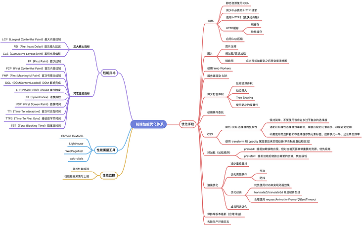

---
nav:
  title: 性能优化
order: 0
---

## 什么是性能优化

前端性能优化是指：从用户开始访问网站到整个页面完整地展现出来的过程中，通过各种优化策略和优化方法，让页面加载得更快，让用户的操作相应更及时，给用户更好的使用体验。

优化工作是围绕前端的基本工作原理展开的，包括：客户端和服务器端建立连接、加载资源、解析资源并渲染。

## 为什么要做性能优化

网站性能会对以下指标产生影响：

- 用户的留存
- 网站的转化率
- 体验与传播
- SEO 排名
