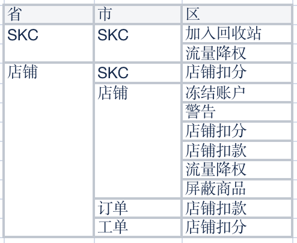

## 1.多级联动

### 描述

开发过程中，我们那常常能遇到`非`常规的多级联动的情况。

### 常规级联栗子

比如：上海市下面 不可能出现跟其他省/市一样的辖区

🌰 来源：https://cople.github.io/LinkageSelector/

```js
[
  {
    code: '11',
    name: '北京市',
    childs: [
      {
        code: '1101',
        name: '市辖区',
        childs: [
          { code: '110101', name: '东城区' },
          { code: '110102', name: '西城区' },
          { code: '110105', name: '朝阳区' },
        ],
      },
    ],
  },
  {
    code: '31',
    name: '上海市',
    childs: [
      {
        code: '3101',
        name: '市辖区',
        childs: [
          { code: '310101', name: '黄浦区' },
          { code: '310104', name: '徐汇区' },
          { code: '310105', name: '长宁区' },
        ],
      },
    ],
  },
  {
    code: '44',
    name: '广东省',
    childs: [
      {
        code: '4401',
        name: '广州市',
        childs: [
          { code: '440103', name: '荔湾区' },
          { code: '440104', name: '越秀区' },
          { code: '440105', name: '海珠区' },
        ],
      },
    ],
  },
];
```

### 实际我们遇到的级联栗子

  

你要相信，最后一列中 `名称重复` 一定是绝对相同的一个东西。

#### 方法 1: json 化

核心代码如下

```js
[{
    "code": "01",
    "name": "SKC",
    "childs": [{
        "code": "001",
        "name": "SKC",
        "childs": [
            { "code": "0001", "name": "加入回收站" },
            { "code": "0002", "name": "流量降权" },
    }]
}, {
    "code": "02",
    "name": "店铺",
    "childs": [{
        "code": "001",
        "name": "SKC",
        "childs": [
            { "code": "00000000003", "name": "店铺扣分" }]
    }, {
        "code": "002",
        "name": "店铺	",
        "childs": [
            { "code": "004", "name": "冻结账户" },
            { "code": "005", "name": "警告" },
            { "code": "00000000003", "name": "店铺扣分" },
            { "code": "00000000000000000000006", "name": "店铺扣款" },
            { "code": "002", "name": "流量降权" },
            { "code": "007", "name": "屏蔽商品" }]
    }, {
        "code": "3101",
        "name": "订单",
        "childs": [
            { "code": "00000000000000000000006", "name": "店铺扣款" }]
    }, {
        "code": "3101",
        "name": "工单",
        "childs": [
            { "code": "00000000003", "name": "店铺扣分" }]
    }
    ]
}]
```

- `带来的问题`: 1、好多重复的数据；2、如果数据量再增加，其实维护成本就会更高了。

#### 方法 2: 每个级联，单独控制

```js
const 省List = [
  { name: 'SKC', value: '01' },
  { name: '店铺', value: '02' },
];
```

```js
const 市List = [
  { name: 'SKC', value: '001', 省Value: '01,02' },
  { name: t('订单'), value: '002', 省Value: '02' },
  { name: t('店铺'), value: '003', 省Value: '02' },
  { name: t('工单'), value: '004', 省Value: '02' },
];
```

```js
const 区List = [
  {
    name: t('加入回收站'),
    value: '0001',
    省市Value: ['01,001'],
  },
  {
    name: t('店铺扣款'),
    value: '0002',
    省市Value: ['02,003', '02,002'],
  },
  {
    name: t('店铺扣分'),
    value: '0003',
    省市Value: ['02,SKC', '02,003', '02,004'],
  },
  {
    name: t('店铺禁用'),
    value: '0004',
    省市Value: ['02,003'],
  },
  {
    name: t('流量降权'),
    value: '0005',
    省市Value: ['01,001', '02,003'],
  },
  {
    name: t('屏蔽商品'),
    value: '0006',
    省市Value: ['02,003'],
  },
  {
    name: t('警告'),
    value: '0007',
    省市Value: ['02,003'],
  },
];
```
